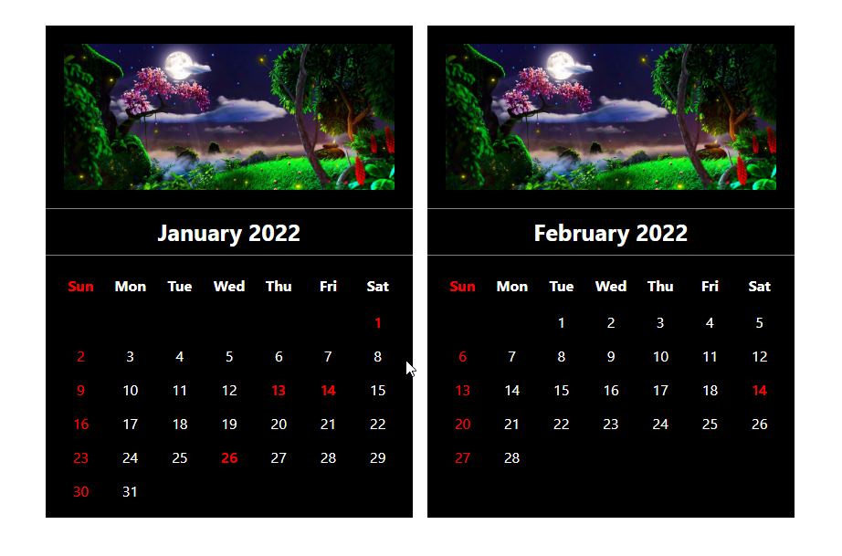
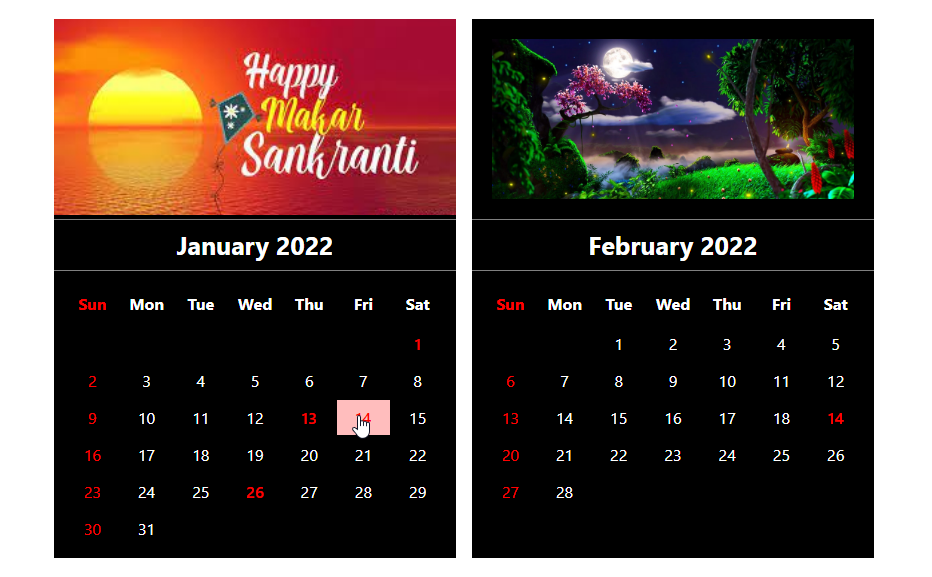

<h1>Calender Web Application</h1>
<strong>Website Link : https://sumedhzodape.github.io/web_dev_projects/small_web_dev_projects/Calender-main/</strong>

This is the calender project. One time on disply two month and it will be slide. and if any festivals are there and we hover on it then it will be show on top of wich festival it is. 

 
<h3>This is the two month at a time display on window screen</h3>

<h3>If user hover on any festival date then it will be shown on top</h3>

