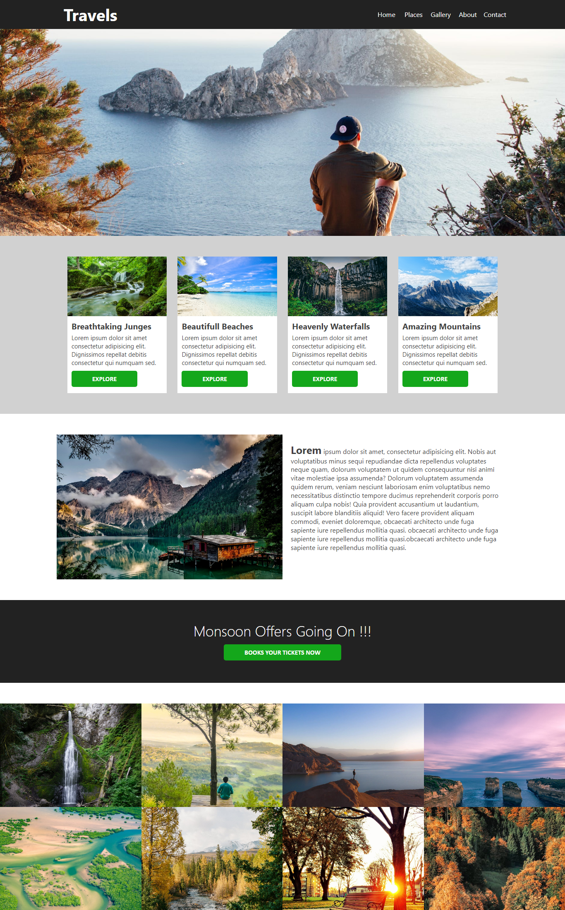
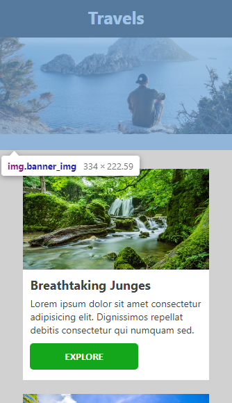
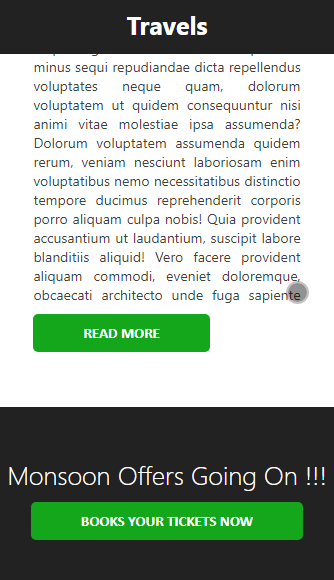
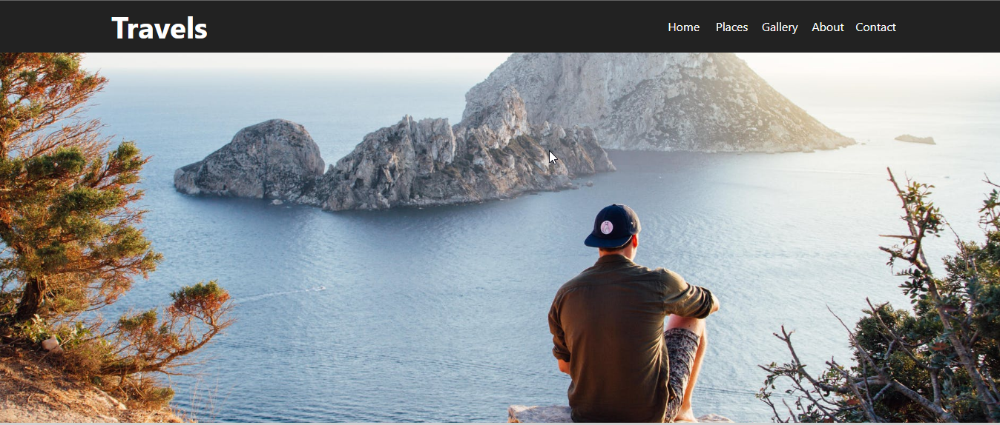
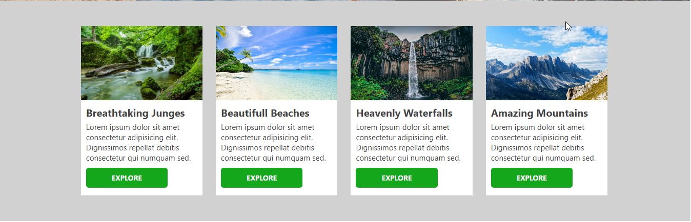
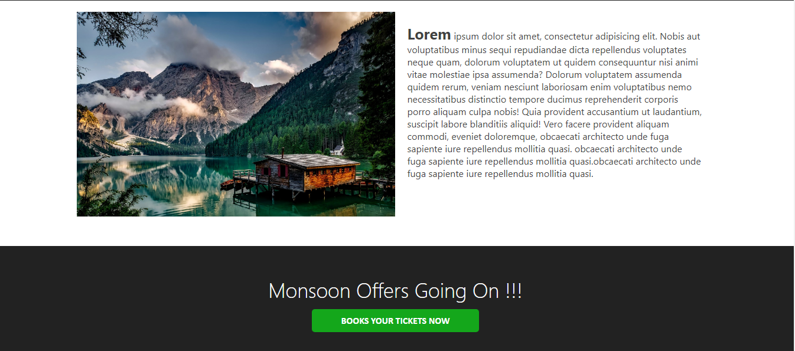
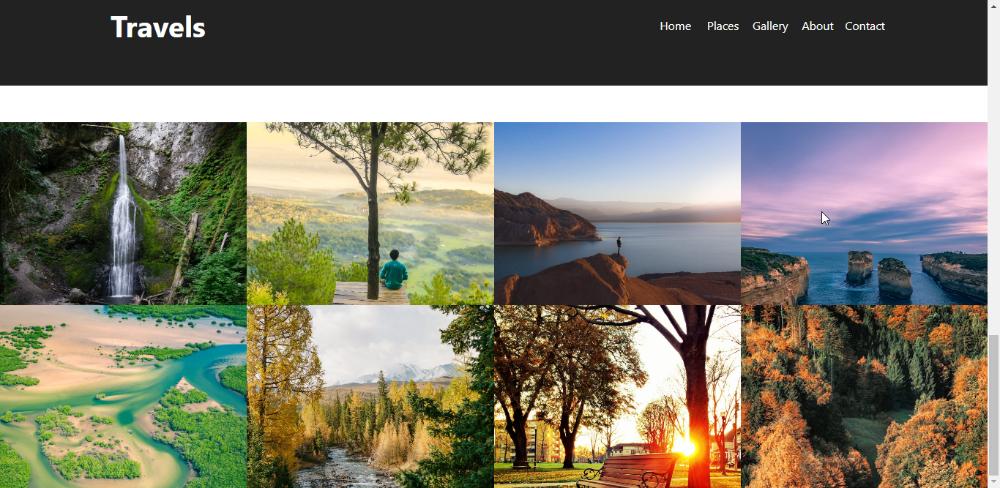

It is a simple travel project. HTML, css and js this technology I used. And It is mobile responsive project. Best and simple design. 

Whole project is look like this

 

how it is look like on mobile responsive screen

 
 

Mobile responsive

 
 
  

Travel project banner

 
 
  

travel Category

 
 
  

Travel Information

 
 
  

Places

 

