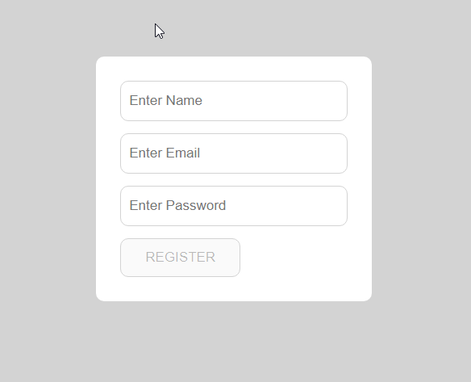
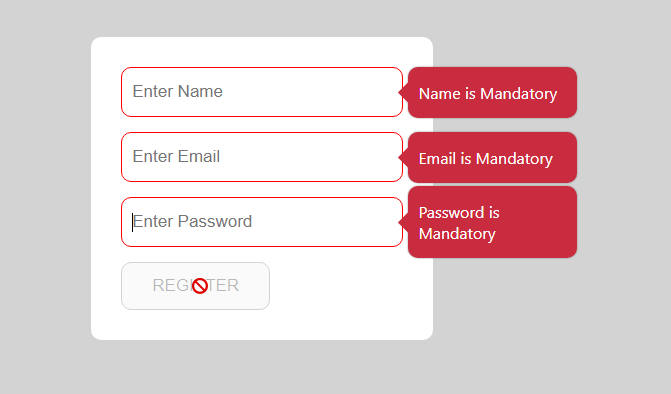
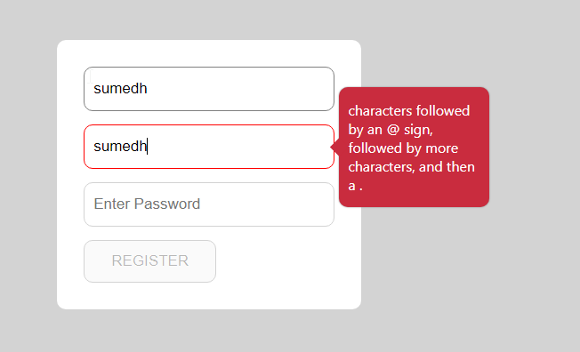
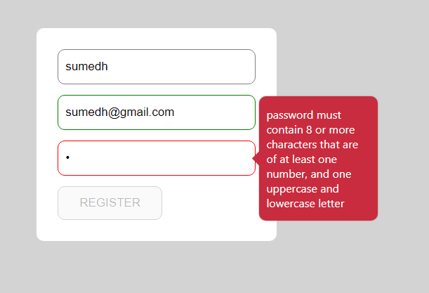
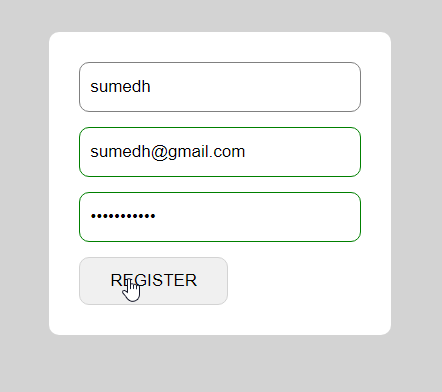

<h1>Form Validation</h1>

It is form validation project all type of validation is here. Name validation, email validation, password validation. HTML, css and java script this technology used here

 
<h3>Form</h3>

<h3>If we can't right anything then required validation is shown</h3>

<h3>Email Validation</h3>

<h3>Password Validation</h3>

<h3>All field is validate then it border will be green color</h3>

