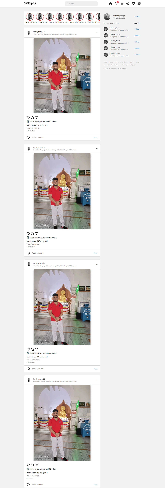
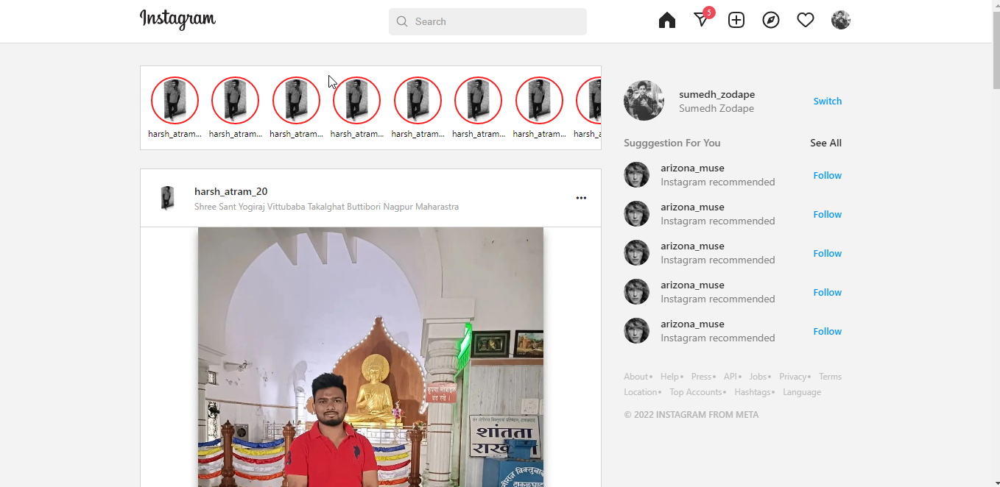

<h1>Instagram Clone</h1>

It is simple instagram clone project. HTML and css this two technology I used here.

 
<h3>Instagram Clone full view</h3>

<h3>Instagram header area</h3>

<h3>Instagram post</h3>

