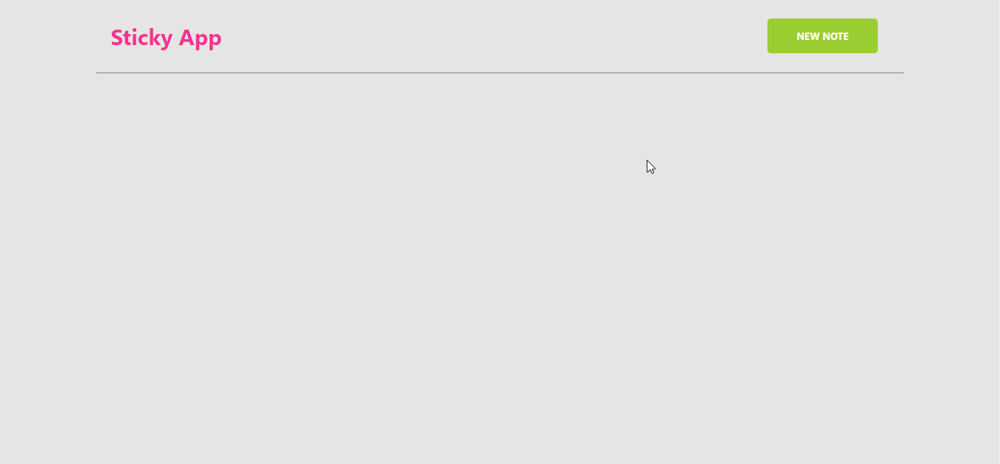
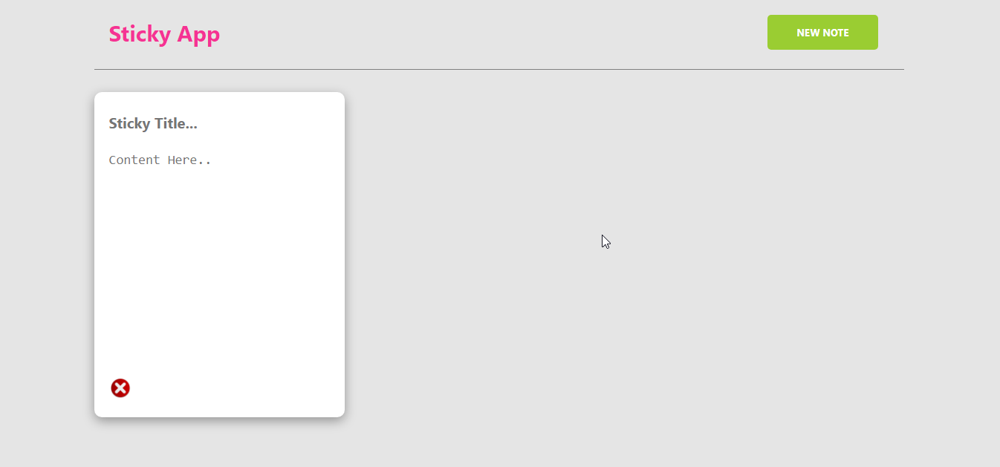
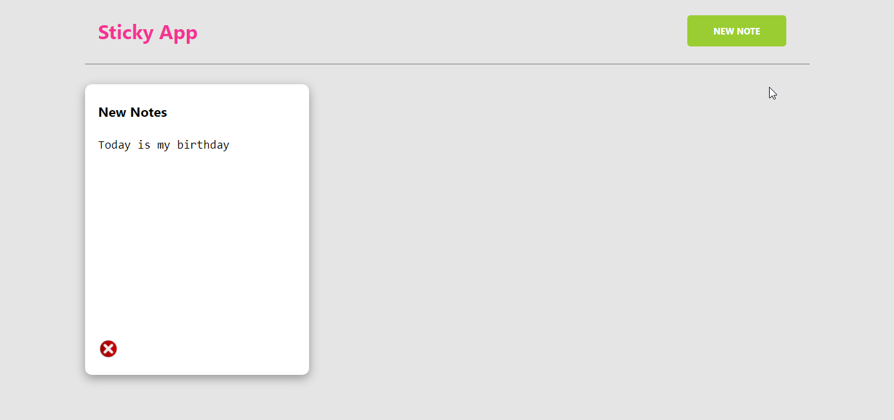

<h1>Sticky Notes</h1>

It is simple sticky notes web application. Here I used HTML, css and java script. If you want to store your note then use it but data will stored on you local storage and if you clear your browser data then it will be deleted.

<h3>Sticky Notes view </h3>

<h3>Create your notes</h3>

<h3>Write title and text</h3>

