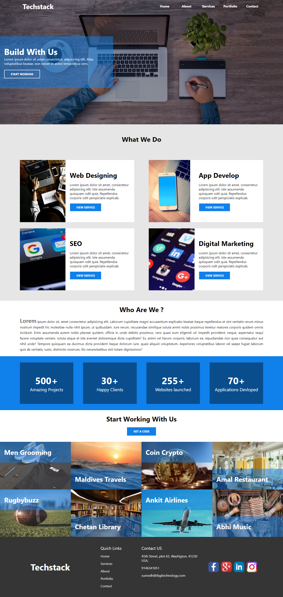
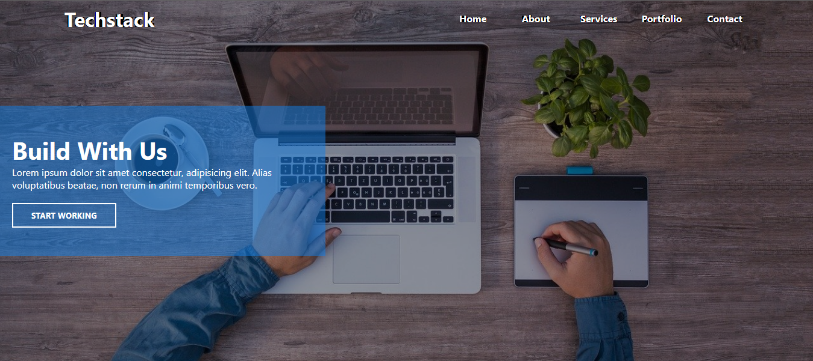
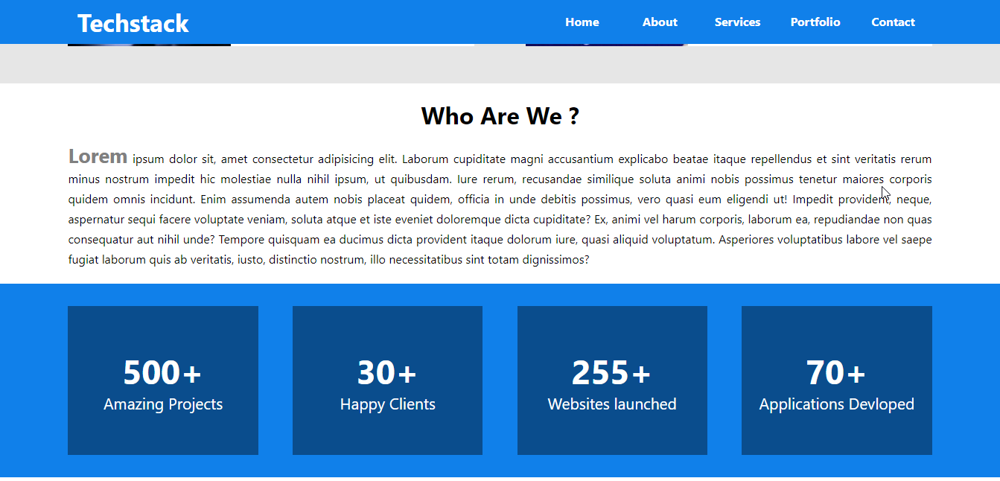
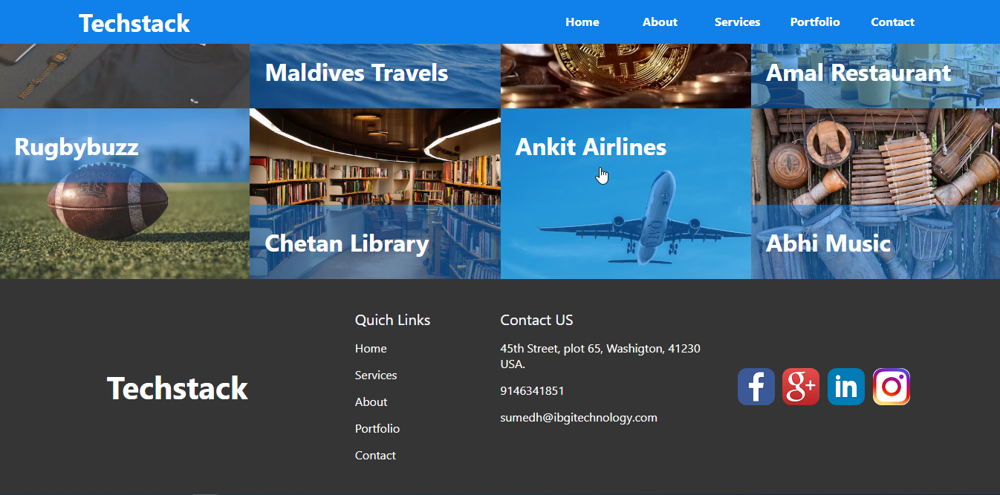

<h1>TechStack Project</h1>

It is simple web application. HTML and css this techonology I used here. There are 5 sections. Header, banner, category, about us, contact us. 

 

<h3>Techstack project view</h3>

<h3>Header and Banner section</h3>

<h3>Categories</h3>

<h3>About Us</h3>

<h3>Footer</h3>

