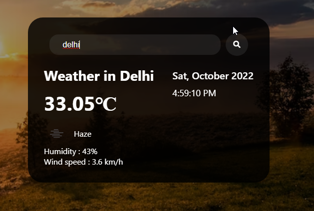

<h1>Weather Web Application</h1>

It is weather app. HTML, css and java script this technology I used here. Here I call weather API(Application Programming Interface) from https://openweathermap.org/api website here you can create your account go to api and copy url and use it

You can check weather any city. Just write city name properly and press enter button. It will show you Date, Time and weather

 
<h3>Weather app view</h3>

<h3>Write any city name and press enter key</h3>

<h3>Write any city name and press enter key</h3>

